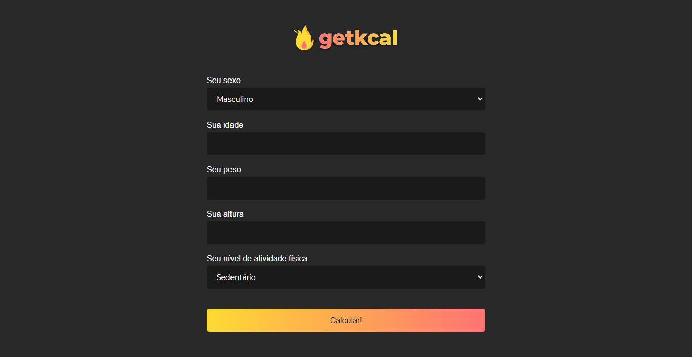

# Vanilla JavaScript kCal Calculator

- Vanilla JS kcal calculator inspired by [maateussilva/getkcal](https://github.com/maateusilva/getkcal)
- Forms manipulation with Vanilla JavaScript

- [Live Site]()

## Screenshots

## What I learned

- [X] preventDefault event function
- [X] Math.round function
- [X] Manipulate HTML inputs and selects with JS

### Author

- Frontend Mentor - [@HenriquePinheiro12](https://www.frontendmentor.io/profile/HenriquePinheiro12)
- Github - [@HenriquePinheiroo12](https://github.com/henriquepinheiro12/)
- Linkedin - [@Henrique Pinheiro](https://www.linkedin.com/in/henrique-pinheiro-a43b62203/)

